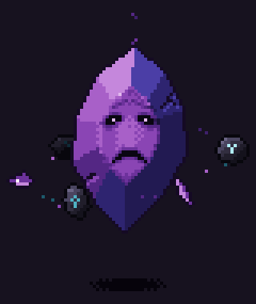

# Gema sufriente: pixel art animado (80×95)



Una gema morada de talla irregular que levita. Dentro hay un rostro atrapado
que sufre en silencio. Tiene la mirada vacía, las cejas de angustia y una boca
que se abre despacio hasta un grito mudo. Después vuelve a hundirse en la
desesperación. No llora. A su alrededor orbitan fragmentos de la propia gema y
piedras de obsidiana con runas que la mantienen sellada.

## Archivos

| Archivo | Qué es |
| --- | --- |
| `gema_sufriente.gif` | Animación a tamaño real (80×95), fondo transparente |
| `gema_sufriente_x4.gif` | Vista previa ampliada ×4 (320×380) con fondo oscuro |
| `gema_sufriente_spritesheet.png` | Tira horizontal de 64 fotogramas de 80×95 (5120×95, RGBA) |
| `generar_gema.py` | Script que dibuja la animación píxel a píxel |

## Datos técnicos

- 64 fotogramas a 80 ms cada uno (12,5 fps). El bucle dura 5,12 s y el último
  fotograma enlaza con el primero sin saltos.
- 28 colores, sin antialiasing. Los píxeles son opacos o transparentes, nunca
  semitransparentes, así que el GIF y el PNG son idénticos.
- En la tira de sprites, el fotograma `i` empieza en `x = i * 80`.

## La gema

Tiene una talla irregular de 10 lados, con una tabla central y facetas de
corona sombreadas según su inclinación real respecto a la luz. Las facetas que
miran a la derecha o hacia abajo viran a azul-violeta. Es el pleocroísmo de
gemas raras como la tanzanita. Tiene dos grietas: una baja hacia el ojo
derecho como una cicatriz y la otra muerde el borde inferior izquierdo.

## Qué pasa en el bucle

| Fotogramas | Momento |
| --- | --- |
| 0–15 | Desesperación contenida: mirada vacía con ojeras y boca abierta con las comisuras caídas. La mandíbula tiembla como un sollozo ahogado y hay un parpadeo lento y pesado (8–9) |
| 16–27 | La angustia crece: aprieta los ojos y la boca se abre hasta el grito |
| 28–40 | Grito mudo: cuencas vacías, boca alargada y mejillas hundidas. La gema tiembla, las grietas dejan escapar luz, dos ondas se expanden y las runas de los sellos brillan para contenerla |
| 41–63 | Se va apagando y vuelve a hundirse en la desesperación |

Durante todo el bucle la gema levita despacio y su sombra crece y encoge con
la altura. Tres piedras de obsidiana con runas cian y tres fragmentos de
amatista giran en una órbita inclinada alrededor de su parte baja, por delante
y por detrás. Por la punta se escapa humo oscuro, y de vez en cuando destella
algún vértice.

## Regenerar o modificar

```bash
pip install pillow
python3 generar_gema.py
```

Lo principal está en constantes de `generar_gema.py`: `PALETTE` (colores),
`FRAMES` y `FRAME_MS` (duración), `OUTLINE` (forma de la gema), `anguish()`
(curva de la angustia), `SHAKE` y `WAVES` (temblor y ondas del grito),
`ORBITERS` (objetos en órbita) y los sprites ASCII del rostro (`EYES_*`,
`MOUTH_*`, `CHEEKS`).
