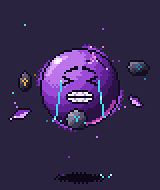

# Orbe sufriente: pixel art animado (80×95)



Un orbe morado que levita con cara de sufrimiento. Llora, aprieta los dientes,
tiene una grieta que brilla por dentro y a su alrededor orbitan fragmentos de
cristal y piedras rúnicas.

## Archivos

| Archivo | Qué es |
| --- | --- |
| `orbe_sufriente.gif` | Animación a tamaño real (80×95), fondo transparente |
| `orbe_sufriente_x4.gif` | Vista previa ampliada ×4 (320×380) con fondo oscuro |
| `orbe_sufriente_spritesheet.png` | Tira horizontal de 48 fotogramas de 80×95 (3840×95, RGBA) |
| `generar_orbe.py` | Script que dibuja la animación píxel a píxel |

## Datos técnicos

- 48 fotogramas a 70 ms cada uno (unos 14 fps). El bucle dura 3,36 s y el
  último fotograma enlaza con el primero sin saltos.
- 32 colores, sin antialiasing. Los píxeles son opacos o transparentes, nunca
  semitransparentes, así que el GIF y el PNG son idénticos.
- En la tira de sprites, el fotograma `i` empieza en `x = i * 80`.

## Qué pasa en el bucle

| Fotogramas | Momento |
| --- | --- |
| 0–29 | Aguanta el dolor: ojos apretados (`> <`), dientes castañeteando y lágrimas que caen al suelo y salpican |
| 30–33 | Se estremece y tiembla |
| 34–40 | Espasmo: grita, la grieta destella, sale una onda de choque y la órbita se abre |
| 41–43 | Solloza |
| 44–47 | Vuelve a aguantar |

Durante todo el bucle el orbe sube y baja dos veces y su sombra crece y
encoge con la altura. Tres piedras con runas (cian y dorada) y tres
fragmentos de cristal giran en una órbita inclinada. Pasan por delante y
por detrás del orbe, y se oscurecen al quedar detrás. El aura gira pegada al
contorno, suben chispas desde la grieta y motas desde la sombra.

## Regenerar o modificar

```bash
pip install pillow
python3 generar_orbe.py
```

Todo está en constantes al principio de cada sección de `generar_orbe.py`:
`PALETTE` (colores), `FRAMES` y `FRAME_MS` (duración), `R` (tamaño del orbe),
`TENSION` / `SCREAM` / `RELEASE` (línea de tiempo), `ORBITERS` (objetos en
órbita) y los sprites ASCII de la cara (`EYES`, `BROWS`, `MOUTH_*`).
